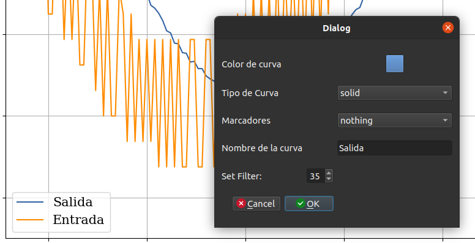
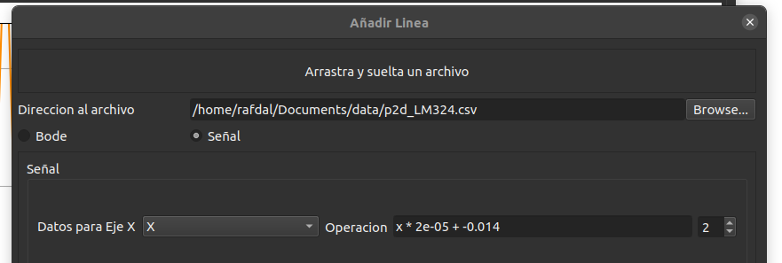

# PlotTool

Para este trabajo, se tomo la [Plot Tool desarrollada por Agustín Gullino](\url{https://github.com/Teoria-de-Circuitos-II/Plot-Tool-Grupo-4}) y se agregó una funcionalidad y dos mejoras en la usabilidad de la aplicación:

## Resumen de Mejoras

- **Nuevas funcionalidades:**
    - Filtro de media móvil configurable para las señales, con la posibilidad de elegir el tamaño de la ventana de 1 a 50
- **Mejoras de usabilidad:**
    - Zona para soltar archivos al agregar mediciones
    - Detección automática de archivos de los osciloscopios marca RIGOL, con selección automática del tipo señal
    - Configuración automática de la escala y offset del tiempo según los datos del CSV de archivos generador por osciloscopio RIGOL

## Capturas de pantalla
A continuación se visualizan las mejoras realizadas:

En esta imagen se puede observar como se ve la versión modificada del *Dialog* o *PopUp* de edición de curva del gráfico, el cual tiene una nueva propiedad numérica llamada "Set Filter" y también en el gráfico se observa su efecto en la curva de color azul, reduciendo su ruido el cual anteriormente era similar a la curva de color naranja. El filtro se desactiva con valor de ventana de 1 (la señal no se modifica) y con un valor de 50 su efecto es el máximo permitido por esta implementación. 

Como se observa en la imagen anterior, ahora la ventana para *Añadir Mediciones* tiene una sección para soltar un archivo.

Además, cuando uno suelta un archivo (y tambien cuando lo abre buscándolo), ahora el programa reconoce automáticamente si se trata de una medición tomada por un osciloscopio RIGOL, se selecciona automáticamente el tipo *Señal* y se agrega automáticamente el ajuste de la escala y offset temporal en la ecuación de la sección "operación", ayudando a agilizar el gráfico de mediciones y el uso de la aplicacion en general.